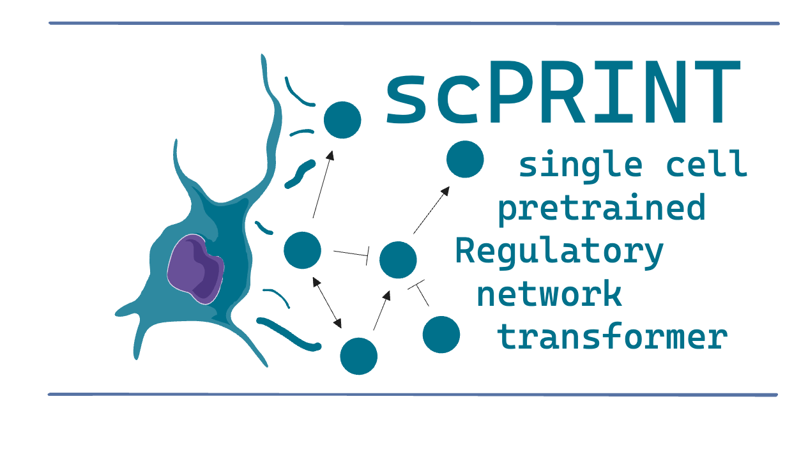

# scPRINT-2: 🏃🏃Your next-gen single cell foundation model

[](https://codecov.io/gh/cantinilab/scPRINT-2)
[](https://github.com/cantinilab/scPRINT-2/actions/workflows/main.yml)
[](https://badge.fury.io/py/scprint-2)
[](https://pepy.tech/project/scprint-2)
[](https://pepy.tech/project/scprint-2)
[](https://pepy.tech/project/scprint-2)
[](https://img.shields.io/github/issues/cantinilab/scPRINT-2)
[](https://github.com/psf/black)
[](https://doi.org/10.5281/zenodo.14749466)
[](https://huggingface.co/jkobject/scPRINT)



scPRINT-2 is a single-cell RNA-seq foundation model built from Kalfon et al. It
uses novel architecture, encoding, decoding, training paradigms and losses.

scPRINT-2 has been pretrained on more than 350 million cells from more than
22,000 datasets and 16 species.

scPRINT-2 can be used to perform the following analyses in a zero-shot mode:

- **expression denoising & imputation**: increase the resolution of your
  scRNAseq data and discover un-measured genes' expression
- **cell embedding and batch correction**: generate a low-dimensional
  representation of your dataset at syntax level (organism, disease, cell type,
  sequencer, ...)
- **label prediction**: predict the cell type, disease, sequencer, sex, age,
  tissue of origin and ethnicity of your cells.
- **gene network inference**: generate a gene network from any cell or cell
  cluster in your scRNAseq dataset
- cross species integration: scPRINT-2 has been trained on 16 species and can be
  used to integrate data from different species.

Example of scPRINT-2 finetuning exist for:

- **new species**: finetune scPRINT-2 on a new organism
- **fine tuning on the labels of your dataset / atlas**: finetune scPRINT-2 on
  your own cell type /disease / age labels.
- **fine tuning on batch correction of your datasets / atlas**: finetune
  scPRINT-2 to integrate data across species, technologies, labs.

scPRINT-2 is a foundation model and can be fine-tuned to perform many other
analysis

[Read the manuscript!]() if you would like to know more about scPRINT-2. Have a
look at some of my [X-plainers](https://twitter.com/jkobject).


🎊 test scPRINT and scDataloader on this simple example
[google collab](https://colab.research.google.com/drive/1CacoQDAwJn86tq2sBhUoZ6M-xAqsYFDI#scrollTo=Lb4E9IhQ7NK8)

## Table of Contents

- [scPRINT-2: 🏃🏃Your next-gen single cell foundation model](#scprint-2-your-next-gen-single-cell-foundation-model)
  - [Table of Contents](#table-of-contents)
  - [Use `scPRINT-2`](#use-scprint-2)
    - [try scPRINT in superbio.ai!](#try-scprint-in-superbioai)
    - [try scPRINT on a google colab notebook!](#try-scprint-on-a-google-colab-notebook)
    - [To know about: lamin.ai](#to-know-about-laminai)
    - [install](#install)
    - [pytorch and GPUs](#pytorch-and-gpus)
  - [Usage](#usage)
    - [scPRINT-2's basic commands](#scprint-2s-basic-commands)
  - [Documentation](#documentation)
  - [Docker](#docker)
    - [Simple tests:](#simple-tests)
  - [FAQ](#faq)
    - [I have a dataset and want a quick analysis:](#i-have-a-dataset-and-want-a-quick-analysis)
    - [I have a dataset and want some more control over what is going on and which model to use:](#i-have-a-dataset-and-want-some-more-control-over-what-is-going-on-and-which-model-to-use)
    - [What does my anndata need to contain to be run with scPRINT-2](#what-does-my-anndata-need-to-contain-to-be-run-with-scprint-2)
    - [I want to generate gene networks from scRNAseq data:](#i-want-to-generate-gene-networks-from-scrnaseq-data)
    - [I want to generate cell embeddings and cell label predictions from scRNAseq data:](#i-want-to-generate-cell-embeddings-and-cell-label-predictions-from-scrnaseq-data)
    - [I want to denoise my scRNAseq dataset:](#i-want-to-denoise-my-scrnaseq-dataset)
    - [I want to generate an atlas-level embedding](#i-want-to-generate-an-atlas-level-embedding)
    - [I need to generate gene tokens using pLLMs](#i-need-to-generate-gene-tokens-using-pllms)
    - [I want to re-train scPRINT-2 from scratch on my own data](#i-want-to-re-train-scprint-2-from-scratch-on-my-own-data)
    - [I want to fine-tune scPRINT-2 on my own data](#i-want-to-fine-tune-scprint-2-on-my-own-data)
    - [how can I find if scPRINT-2 was trained on my data?](#how-can-i-find-if-scprint-2-was-trained-on-my-data)
    - [can I use scPRINT-2 on other organisms rather than human?](#can-i-use-scprint-2-on-other-organisms-rather-than-human)
    - [how long does scPRINT-2 takes? what kind of resources do I need? (or in alternative: can i run scPRINT-2 locally?)](#how-long-does-scprint-2-takes-what-kind-of-resources-do-i-need-or-in-alternative-can-i-run-scprint-2-locally)
    - [I have different scRNASeq batches. Should I integrate my data before running scPRINT-2?](#i-have-different-scrnaseq-batches-should-i-integrate-my-data-before-running-scprint-2)
    - [where to find the input gene embeddings?](#where-to-find-the-input-gene-embeddings)
    - [I want to extract output gene embeddings from scPRINT-2](#i-want-to-extract-output-gene-embeddings-from-scprint-2)
  - [Development](#development)
    - [dev install](#dev-install)
    - [Reproducibility](#reproducibility)
    - [Building the Docker Image](#building-the-docker-image)
    - [Pulling the Docker Image from Docker Hub](#pulling-the-docker-image-from-docker-hub)
    - [Running the Docker Container](#running-the-docker-container)
    - [Participate](#participate)
  - [Work in progress (PR welcomed):](#work-in-progress-pr-welcomed)

## Use `scPRINT-2`

For the moment scPRINT-2 has been tested on MacOS and Linux (Ubuntu 20.04) with
Python 3.10+. Its instalation takes on average 2 minutes in `uv` but longer on
`conda`.

Example of our previous generation
[scPRINT-1](https://github.com/cantinilab/scPRINT) model exist in multiple
places (don't forget to star it as well!):

### try scPRINT in superbio.ai!

[HERE](https://app.superbio.ai/apps/67333115ed44f27eb717cf84)

### try scPRINT on a google colab notebook!

[](https://colab.research.google.com/drive/1CacoQDAwJn86tq2sBhUoZ6M-xAqsYFDI#scrollTo=Vj73HINSzKHL)

### To know about: lamin.ai

To use scPRINT-2, you will need to use [lamin.ai](https://lamin.ai/). This is
needed to load biological informations like genes, cell types, organisms.. (but
also to manage the pre-training datasets if this is something you want to set
up)

### install

[Here, is how to install uv](https://docs.astral.sh/uv/getting-started/installation/)

```bash
uv venv <env-name> --python 3.11
source <env-name>/bin/activate
#one of
uv pip install scprint2
# OR uv pip install scprint2[dev] # for the dev dependencies (building etc..) OR
# OR uv pip install scprint2[flash] # to use flashattention2 with triton: only if you have a compatible gpu (e.g. not available for apple GPUs for now, see https://github.com/triton-lang/triton?tab=readme-ov-file#compatibility)
#OR pip install scprint2[dev,flash]

lamin init --storage ./testdb --name test --modules bionty
```

⚠️ `./testdb` is set in this example but be mindful about where you want to
store your data, this might get quite big as you use it and if you are on
specific partition you want to consider this.

if you start with lamin and had to do a `lamin init`, you will also need to
populate your ontologies. This is because scPRINT-2 is using ontologies to
define its cell types, diseases, sexes, ethnicities, etc.
([link to view ontologies](https://www.ebi.ac.uk/ols4/ontologies/cl/classes/http%253A%252F%252Fpurl.obolibrary.org%252Fobo%252FCL_0000057))

you can do it via the command:

`scdataloader populate all`

⚠️ It is ok to get warnings with this function

or with this function:

```python
from scdataloader.utils import populate_my_ontology

populate_my_ontology() #to populate everything (recommended) (can take 2-10mns)

populate_my_ontology( #the minimum for scprint2 to run some inferences (denoising, grn inference)
organisms: List[str] = ["NCBITaxon:10090", "NCBITaxon:9606"],
    sex: List[str] = ["PATO:0000384", "PATO:0000383"],
    celltypes = None,
    ethnicities = None,
    assays = None,
    tissues = None,
    diseases = None,
    dev_stages = None,
)
```

We make use of some additional packages we developed alongside scPRINT-2 (they
are also shipped with scprint-2 already).

Please refer to their documentation for more information:

- [scDataLoader](https://github.com/jkobject/scDataLoader): a dataloader for
  training large cell models.
- [GRnnData](https://github.com/cantinilab/GRnnData): a package to work with
  gene networks from single cell data.
- [benGRN](https://github.com/jkobject/benGRN): a package to benchmark gene
  network inference methods from single cell data.

### pytorch and GPUs

scPRINT-2 can run on machines without GPUs, but it will be slow. It is highly
recommended to use a GPU for inference.

Most of the time, everything works out of the box, otherwise please send an
issue

```python
model = scPrint.load_from_checkpoint(
    '../data/temp/last.ckpt', precpt_gene_emb=None)
```

you will know more by following the
[get-started](https://cantinilab.github.io/scPRINT-2/notebooks/cancer_usecase/)
notebook.

## Usage

To get a sense of how scPRINT-2 works, have a look at our
[get-started](https://cantinilab.github.io/scPRINT-2/notebooks/cancer_usecase/)
notebook.

To start you will also need to download a checkpoint of a pretrain model like
v2-medium or some others from
[hugging face](https://huggingface.co/jkobject/scPRINT-2/)

```bash
$ hf download jkobject/scPRINT v2-medium.ckpt --local-dir .
```

### scPRINT-2's basic commands

This is the a template of how you would go and use scPRINT most of the time:

```py
# import stuff
from lightning.pytorch import Trainer
from scprint import scPrint
from scdataloader import DataModule

# setup a datamodule to train scprint from scratch
datamodule = DataModule(...)
# setup a model parameter
model = scPrint(...)
# to train / fit / test the model setup a trainer
trainer = Trainer(...)
# call the fit function
trainer.fit(model, datamodule=datamodule)
# to do predictions Denoiser, Embedder, GNInfer
denoiser = Denoiser(...)
adata = sc.read_h5ad(...)
denoiser(model, adata=adata)
...
```

or, from a bash command line

then finetune or analyse on your data

```bash
$ scprint fit/train/predict/test/denoise/embed/gninfer --config config/[medium|large|vlarge] ...
```

to denoise a dataset:

```bash
$ scprint denoise --adata my_human_anndata.h5ad --ckpt_path v2-medium.ckpt --species "NCBITaxon:9606" --output_filename denoised.h5ad
```

to do embedding and classification on a dataset: (the current version implies
doing a PCA and Umap so it might need a lot of RAM if run as is)

```bash
$ scprint embed --adata my_human_anndata.h5ad --ckpt_path v2-medium.ckpt --species "NCBITaxon:9606" --output_filename embedded.h5ad
```

to do gene network inference on a dataset:

```bash
$ scprint gninfer --adata my_human_anndata.h5ad --ckpt_path v2-medium.ckpt --species "NCBITaxon:9606" --cell_type 'cell_type_name_from-cell_type-obs_col' --output_filename grn.h5ad
```

to finetune scPRINT on your data:

```bash
$ scprint fit --config config/base_v2.yml --config config/pretrain_large.yml --ckpt_path large.ckpt
```

find out more about the commands by running `scprint --help` or
`scprint [command] --help`.

more examples of using the command line are available in the
[docs](./docs/usage.md).

## Documentation

For more information on usage please see the documentation in
[https://www.jkobject.com/scPRINT-2/](https://cantinilab.github.io/scPRINT-2)

## Docker

By using the `scPRINT-2 Docker image`, you can bypass the complexities of manual
package installation, ensuring a consistent deployment environment. Included in
this repository is a Dockerfile that lets you craft a container for the project;
you have the choice to either build this image on your own or conveniently pull
it from Docker Hub.

Make sure that you have the `docker` command line interface installed on your
system.

A recommended way to install docker with the correct nvidia drivers on linux is
to use this
[script](https://gist.github.com/xueerchen1990/baad7baa545cb547e8633bc9e5b84786)

/!\ A MORE UP TO DATE DOCKER IMAGE is made as part of the open-problems
benchmark and available in their github for all tasks where scPRINT-2 is
benchmarked

### Simple tests:

An instalation of scPRINT-2 and a simple test of the denoiser is performed
during each commit to the main branch with a
[Github action](https://github.com/cantinilab/scPRINT-2/actions) and
[pytest workflow](.github/workflows/main.yml). It also provides an expected
runtime for the installation and run of scPRINT-2. We now explore the different
usages of scPRINT-2:

## FAQ

### I have a dataset and want a quick analysis:

-> use [superbio](#try-scprint-in-superbioai)

### I have a dataset and want some more control over what is going on and which model to use:

you will need to understand a few things like lamindb, scdataloader and
scprint-2's inference tool.

-> start with a quick intro using the
[google collab notebook](#try-scprint-on-a-google-colab-notebook)

-> look at the other FAQ element based on your desired use-case

### What does my anndata need to contain to be run with scPRINT-2

-> your anndata only needs to contain the species ontology id in its
obs['organism_ontology_term_id'] (e.g. "NCBITaxon:9606"). It also needs to
contain .var_names or .var.index with gene ids defined as ENSEMBL_IDs or
HUGO_SYMBOL.

-> That's it. you can then follow the preprocessing steps from various example
notebooks to align your anndata to our gene set, make sure that it fits our
requirements and then send it to the model!

### I want to generate gene networks from scRNAseq data:

-> Refer to the section . gene network inference in
[this notebook](./docs/notebooks/cancer_usecase.ipynb#).

-> More examples in this notebook
[./notebooks/assessments/bench_omni.ipynb](./notebooks/bench_omni.ipynb).

### I want to generate cell embeddings and cell label predictions from scRNAseq data:

-> Refer to the embeddings and cell annotations section in
[this notebook](./docs/notebooks/cancer_usecase.ipynb#).

### I want to denoise my scRNAseq dataset:

-> Refer to the Denoising of B-cell section in
[this notebook](./docs/notebooks/cancer_usecase.ipynb).

-> More example in our benchmark notebook
[./notebooks/assessments/bench_denoising.ipynb](./notebooks/bench_denoising.ipynb).

### I want to generate an atlas-level embedding

-> Refer to the notebook [nice_umap.ipynb](./figures/nice_umap.ipynb).

### I need to generate gene tokens using pLLMs

To run scPRINT-2, you can use the option to define the gene tokens using protein
language model embeddings of genes. This is done by providing the path to a
parquet file of the precomputed set of embeddings for each gene name to
scPRINT-2 via "precpt_gene_emb"

-> To generate this file please refer to the notebook
[generate_gene_embeddings](notebooks/generate_gene_embeddings.ipynb).

### I want to re-train scPRINT-2 from scratch on my own data

-> Refer to the documentation page [pretrain scprint-2](docs/pretrain.md)

### I want to fine-tune scPRINT-2 on my own data

-> make sure that you did a few run of scPRINT-2's inference e.g.
[this one](#i-want-to-generate-cell-embeddings-and-cell-label-predictions-from-scrnaseq-data)

-> make sure that you read the [pretrain scprint-2](docs/pretrain.md)
documentation

-> re-use the same logic as in the
[scprint-train](notebooks/scprint_train.ipynb) notebook but apply the necessary
modification in term of tasks, learning rate or parameter-efficient-fine-tuning
method, if you think you will need it (given the small size of the model, this
not necessary at all). This is the step where you will get your hands dirty. you
might want to really understand how the model
[collates](https://www.jkobject.com/scDataLoader/collator/) data, and
[train](https://cantinilab.github.io/scPRINT-2/model/#scprint.model.model.scPrint.training_step)

### how can I find if scPRINT-2 was trained on my data?

If your data is available in cellxgene, scPRINT-2 was likely trained on it.
However some cells, datasets were dropped due to low quality data and some were
randomly removed to be part of the validation / test sets.

### can I use scPRINT-2 on other organisms rather than human?

scPRINT-2 has been pretrained on both humans and mouse, and can be used on any
organism with a similar gene set. If you want to use scPRINT-2 on very different
organisms, you will need to generate gene embeddings for that organism and
re-train scPRINT-2

### how long does scPRINT-2 takes? what kind of resources do I need? (or in alternative: can i run scPRINT-2 locally?)

please look at our supplementary tables in the
[manuscript](https://www.biorxiv.org/content/10.1101/2024.07.29.605556v1)

### I have different scRNASeq batches. Should I integrate my data before running scPRINT-2?

scPRINT-2 takes raw count as inputs, so please don't use integrated data. Just
give the raw counts to scPRINT-2 and it will take care of the rest.

### where to find the input gene embeddings?

If you think you need the gene embeddings file for loading the model from a
checkpoint, you don't, as the embeddings are also stored in the model weights.
You just need to load the weights like this:

```python
model = scPrint.load_from_checkpoint(
    '../../data/temp/last.ckpt',
    precpt_gene_emb=None,
)
```

You can also recreate the gene embedding file through
[this notebook](notebooks/generate_gene_embeddings.ipynb). Just call the
functions, and it should recreate the file itself.

the file itself is also available on
[hugging face](https://huggingface.co/jkobject/scPRINT-2/tree/main)

/!\ Please understand that what I mean by gene embedding are the immutable input
gene embeddings encoding the gene name. scPRINT-2 directly takes raw counts as
input and takes care of doing the embedding on the fly. (it does similarly for a
gene's location in the genome).

### I want to extract output gene embeddings from scPRINT-2

I created a novel task script that should work similarly to the other ones (make
sure that you understood how they work by running at least one inference
notebook) in [scprint/tasks/gene_emb.py](scprint/tasks/gene_emb.py) `

## Development

### dev install

If you want to use the latest version of scPRINT-2 and work on the code yourself
use `git clone` and `pip -e` instead of `pip install`.

```bash
git clone https://github.com/cantinilab/scPRINT-2
git clone https://github.com/jkobject/scDataLoader
git clone https://github.com/cantinilab/GRnnData
git clone https://github.com/jkobject/benGRN
pip install -e scprint2[dev]
pip install -e scDataLoader[dev]
pip install -e GRnnData[dev]
pip install -e benGRN[dev]
```

### Reproducibility

**To reproduce the paper please use the version / tag `1.6.4` and you will have
to git clone the repo to have access to all the pre-training functionalities!**

⚠️ When re-training scPRINT-2 from scratch, by default, every N epoch, the
`test()` function will be called `. It is using a predownloadedtest datasets
paths (see https://github.com/cantinilab/scPRINT-2/issues/12). Replace them with
your own paths you want to use these test functions. They are also made
available on hf.co: https://huggingface.co/jkobject/scPRINT-2/tree/main

### Building the Docker Image

To build the Docker image from the provided `Dockerfile`, run the following
command from the root directory of this repository:

```bash
docker build -t scprint2:latest -f Dockerfile .
```

### Pulling the Docker Image from Docker Hub

If you don't want to build the image yourself, you can pull it directly from
Docker Hub:

```bash
docker pull jkobject/scprint2:1.2.0
docker tag jkobject/scprint2:1.2.0 scprint2:latest
```

### Running the Docker Container

Once you have the image (either by building it or pulling it), you can start a
container with:

```bash
docker run --gpus all --rm -it scprint2:latest bash
```

Please note: When running the Docker container, ensure you mount any necessary
folders using the -v option to access them inside the container.

### Participate

Read the [CONTRIBUTING.md](CONTRIBUTING.md) file.

Read the
[training runs](https://wandb.ai/ml4ig/scprint_scale/reports/scPRINT-trainings--Vmlldzo4ODIxMjgx?accessToken=80metwx7b08hhourotpskdyaxiflq700xzmzymr6scvkp69agybt79l341tv68hp)
document to know more about how pre-training was performed and the its behavior.

code coverage is not right as I am using the command line interface for
now. >50% of the code is covered by my current unit test.

Acknowledgement:
[python template](https://github.com/rochacbruno/python-project-template)
[laminDB](https://lamin.ai/) [lightning](https://lightning.ai/)

## Work in progress (PR welcomed):

1. remove the triton dependencies
2. add version with additional labels (tissues, age) and organisms (mouse,
   zebrafish) and more datasets from cellxgene
3. version with separate transformer blocks for the encoding part of the
   bottleneck learning and for the cell embeddings
4. improve classifier to output uncertainties and topK predictions when unsure
5. setup latest lamindb version

Awesome Large Cell Model created by Jeremie Kalfon.
